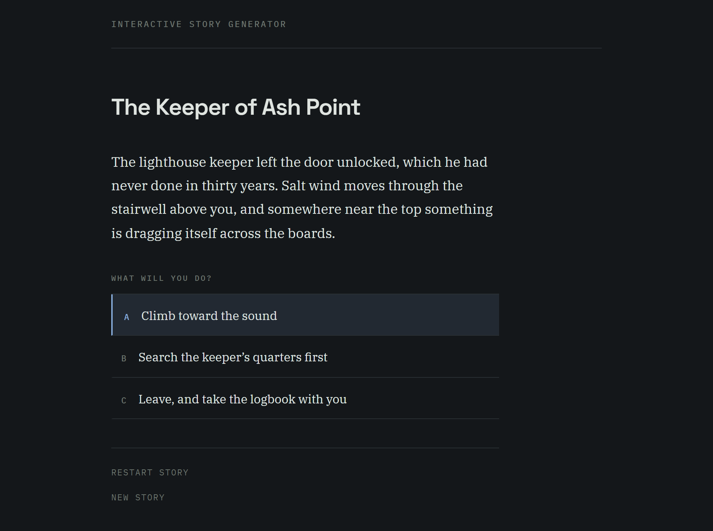
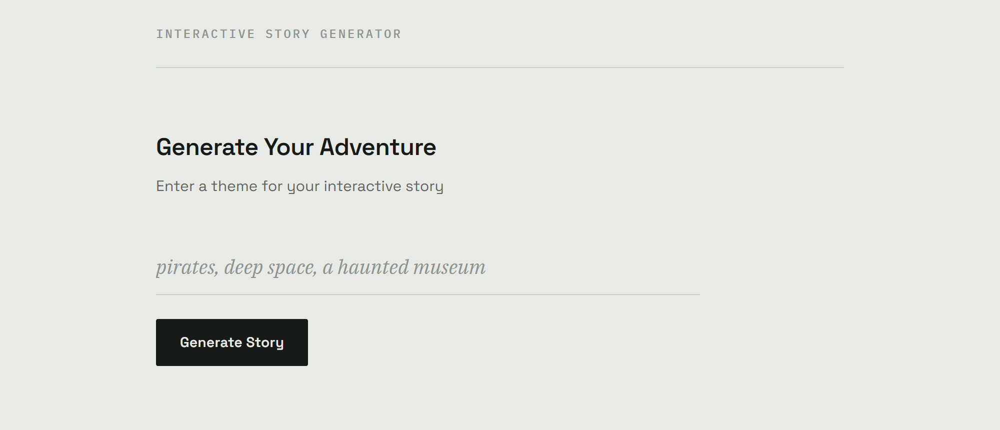

# StoryGenAI

Generate a branching choose-your-own-adventure story from a single word, then play it in the browser.

You type a theme. Claude writes a complete story tree with multiple paths and endings. The app saves every node to Postgres and lets you walk the branches one choice at a time.



<p align="center"><em>Playing a generated story. Light and dark both ship.</em></p>



---

## How it works

Story generation takes longer than a request should, so it runs as a background job and the client polls for the result.

```
POST /api/stories/create        →  job created, status "pending", returns job_id
     background task starts     →  status "processing"
     Claude returns the tree     →  nodes persisted, status "completed", story_id set
GET  /api/jobs/{job_id}         →  client polls until completed or failed
GET  /api/stories/{id}/complete →  full story tree, keyed by node id
```

The LLM is constrained with a Pydantic schema through LangChain's `PydanticOutputParser`, so the response comes back as a validated `StoryLLMResponse` instead of loose JSON. The tree is then flattened into rows recursively, with each node storing its options as JSON pointing at child node ids.

---

## Stack

**Backend** — FastAPI, SQLAlchemy 2.0, Pydantic v2, LangChain with `langchain-anthropic`, Postgres. Managed with uv on Python 3.14.

**Frontend** — React 19, Vite, React Router 7, axios. No UI framework, no CSS library.

**Model** — `claude-sonnet-4-6`.

---

## Project structure

```
backend/
  core/          config, prompts, LLM models, story generator
  db/            engine and session
  models/        SQLAlchemy tables (Story, StoryNode, StoryJob)
  routers/       /stories and /jobs
  schemas/       API request and response models
  main.py        app entrypoint, CORS, router wiring
frontend/
  src/components/
    ThemeInput       theme form
    StoryGenerator   create job, poll status, redirect
    StoryLoader      fetch a story by id
    StoryGame        render nodes, handle choices
    LoadingStatus    generation progress
```

---

## API

| Method | Route | Purpose |
| --- | --- | --- |
| `POST` | `/api/stories/create` | Start a generation job. Body: `{ "theme": "pirates" }` |
| `GET` | `/api/stories/{story_id}/complete` | Full story tree with root node and all nodes |
| `GET` | `/api/jobs/{job_id}` | Job status: `pending`, `processing`, `completed` or `failed` |

Interactive docs are served at `/docs`.

Sessions use an httpOnly `session_id` cookie so a visitor can be tied to their stories without accounts.

---

## Running locally

You need Python 3.14, Node 20+, a Postgres database and an Anthropic API key.

**Backend**

```bash
cd backend
uv sync
cp .env.example .env    # then fill in the values
uv run uvicorn main:app --reload
```

Runs on `http://localhost:8000`.

**Frontend**

```bash
cd frontend
npm install
npm run dev
```

Runs on `http://localhost:5173`. Vite proxies `/api` to the backend, so no CORS setup is needed in development.

**Environment**

| Variable | Description |
| --- | --- |
| `DATABASE_URL` | Postgres connection string |
| `ANTHROPIC_API_KEY` | Anthropic API key |
| `ALLOWED_ORIGINS` | Comma separated origins for CORS |
| `API_PREFIX` | Route prefix, defaults to `/api` |
| `DEBUG` | Defaults to `false` |

`.env` is gitignored. Never commit it.

---

## Deploying to AWS

Planned target:

- **Database** — RDS for Postgres
- **Backend** — containerised and run on ECS Fargate behind an Application Load Balancer
- **Frontend** — static build on S3 with CloudFront in front
- **Secrets** — `DATABASE_URL` and `ANTHROPIC_API_KEY` in Secrets Manager, injected as task environment variables

Two things need changing before this is production ready. `create_tables()` runs on import in `main.py`, which should become a migration step. Generation runs in a FastAPI `BackgroundTasks` worker tied to the request process, which does not survive a container restart and should move to a queue.

---

## Notes

This is a portfolio project built to practise structured LLM output, recursive data modelling and async job handling. The story tree is the interesting part: getting a model to reliably emit a nested, self-referential structure that maps cleanly onto relational rows.